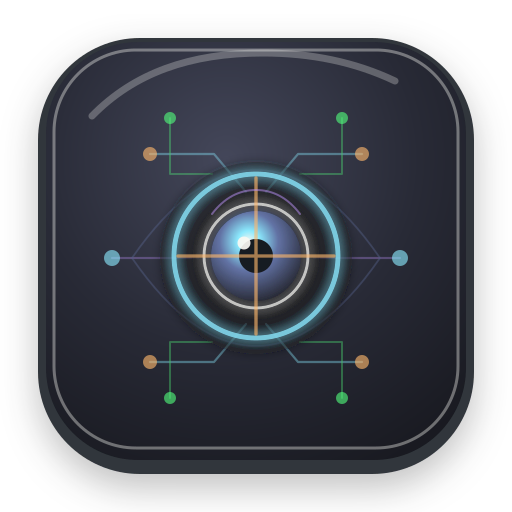

# Visual Agent

<p align="center">
  
</p>

Visual Agent is a Kotlin desktop application. Its goal is to provide the model with as many tools as possible so it can visualize its own output — today that includes a canvas, workspace files, and a todo/sub-agent system; future work will add more rendering and interaction surfaces.

> **Development notice:** This project was written entirely with LLM assistance and is still under active development.
> Expect rapid changes, incomplete features, and rough edges until the project reaches a stable release.

## Download and Run

Each successful build on `master` publishes an executable JAR to GitHub Packages. You need a GitHub personal access token with `read:packages` scope to download it.

1. Download the latest package that matches your operating system from the [GitHub Packages registry](https://github.com/heckenmann/visual-agent/packages):

   - Linux: `visual-agent-linux`
   - macOS on Intel: `visual-agent-macos-x64`
   - macOS on Apple Silicon: `visual-agent-macos-arm64`
   - Windows: `visual-agent-windows`

   Each package contains the native Compose runtime for its platform.
2. Run it with Java 21 or later:

   ```bash
   java -jar visual-agent-<platform>-0.1.0-master-<version>.jar
   ```

   Visual Agent needs a desktop environment (it won't run headless).

3. On first launch it creates a local SQLite database under `./data/` and opens the Compose UI.

## Features

- Chat with local (Ollama) or remote (OpenAI-compatible) models, with streaming responses.
- Editable canvas where the model can draw text, shapes, and images.
- Managed workspace files the model can import, read, search, and render (including PDF page previews).
- Todo list and sub-agents that can work on tasks autonomously.
- Per-agent tool configuration, provider profiles, and persisted settings.
- Command palette (`Cmd/Ctrl+K`) and customizable workspace panel layout.
- Icon-only actions with descriptive tooltips throughout the Compose workspace.

See the [use-case catalog](docs/usecases/) for the full list of user-visible functions.

## Prerequisites and Build from Source

See [Setup Guide](docs/setup.md) for prerequisites, build/run commands, Ollama configuration, persistence, and troubleshooting.

```bash
./gradlew build
./gradlew :application:run
```

## Gradle Modules

The project uses an acyclic Gradle module graph:

```text
:application
 ├── :ui
 └── :providers
```

`:application` is the only composition root and the only module allowed to depend on Visual Agent submodules. `:ui` and `:providers` are independent leaf modules: neither may depend on `:application`, the other leaf module, or a future sibling module.

Filesystem ownership follows the same structure:

```text
application/          # :application
modules/ui/           # :ui
modules/providers/    # :providers
```

Run targeted module tasks from the repository root:

```bash
./gradlew :ui:build :ui:test
./gradlew :providers:build :providers:test
./gradlew :application:build :application:test
./gradlew :application:run
```

See the module READMEs for ownership and migration details: [`:application`](application/README.md), [`:ui`](modules/ui/README.md), and [`:providers`](modules/providers/README.md).

## Documentation

- [Architecture](docs/architecture.md) — runtime layers, provider routing, tool system, persistence, in-flight indicator, current constraints
- [Gradle Module Architecture](docs/gradle-module-architecture.md) — module graph, dependency rules, migration sequence, and verification commands
- [API Reference](docs/api.md) — `LLMProvider`, Spring AI integration, tool-calling contracts, activity surface
- [Database Schema](docs/database.md) — SQLite schema, indexes, persistence behavior
- [SubAgents](docs/subagents.md) — autonomous/sub-agent model, tool sets, autonomous loop
- [Compose Migration Audit](docs/compose-migration-audit.md) — per-requirement evidence for the JavaFX to Compose Multiplatform decision
- [Development Conventions](docs/conventions.md) — use-case traceability and documentation rules

## License

MIT License
